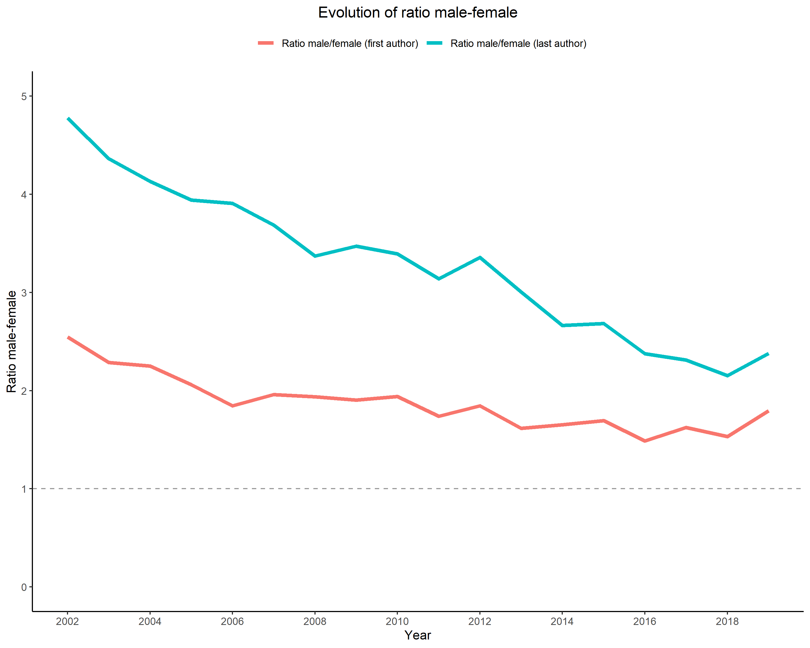

# Trends in Gender of Authors Among Major Medical Journals in the Field of Oncology

**Authors**  
*(include authors)*

# Abstract
**Importance**: This is a comprehensive analysis of gender authorship in original research as it is lacking in the field of oncology.

**Objective**: to evaluate the temporal trend of gender ratio of first and last authors in the global oncological research field among major general medical and oncology journals, and compared to the gender composition of the US oncologists. Second, we examined the gender pattern in coauthorship.

**Design**: An automatic literature review was conducted using R package RISmed to search in PubMed. We retrieved the original research articles from 4 general medical and 6 oncology specialty journals which were selected based on their impact factors and popularity among oncologists. We identified the journal the first and last authors for the period Jan 1 2002 to Dec 31 2019. Author’s gender was identified and validated using the software Gender-API. 

**Main Outcome and Measure**: We estimated the percentages of first and last authors by gender and the gender ratios (male/female) in different journals. Temporal trends in gender ratios of first and last authors were analyzed according to calendar period and journals.

**Results** We identified the gender of first and last authors for 33,226 research articles. The proportion of female first and last authors increased from 28% in 2002 to 36% in 2019, and 17% to 30% respectively. The first and last author gender ratios for the period in analysis decreased by 2.0% and 3.3%, respectively (i.e., incidence rate ratio [IRR]: -0.022; 95% confidence interval [CI] -0.059 to 0.014, P for trend .227 for the first author and by 3.3% IRR: -0.033; 95% CI -0.070 to 0.000, P for trend .071 for the last author). Male first and last coauthorship is the most common combination but it was decreasing. The male-male pairs significantly decreased by 2% (IRR: 0.98; 95% CI 0.98 to 0.99, P <.001), whereas the male-female and female-female pairs increased by 2.0% and 5.0% over time (IRR: 1.02, 95% CI 1.01 to 1.03, P <.001 and IRR: 1.05, 95% CI 1.04 to 1.06, P <.001, respectively).

**Conclusions and Relevance**: We found weak evidence of improvement in female’s participation as first and last author over the study period. The continued underrepresentation of female particularly as a last author implied that while more women are becoming oncologists, they are not publishing at a comparable increasing rate. Ongoing efforts to address parity and improve conditions for advancement of female in academic oncology are needed.

**Keywords**: *gender studies*, *neoplasms*, *research*, *cancer epidemiology*, *publications*.

This repository provides open source code for replicability.
