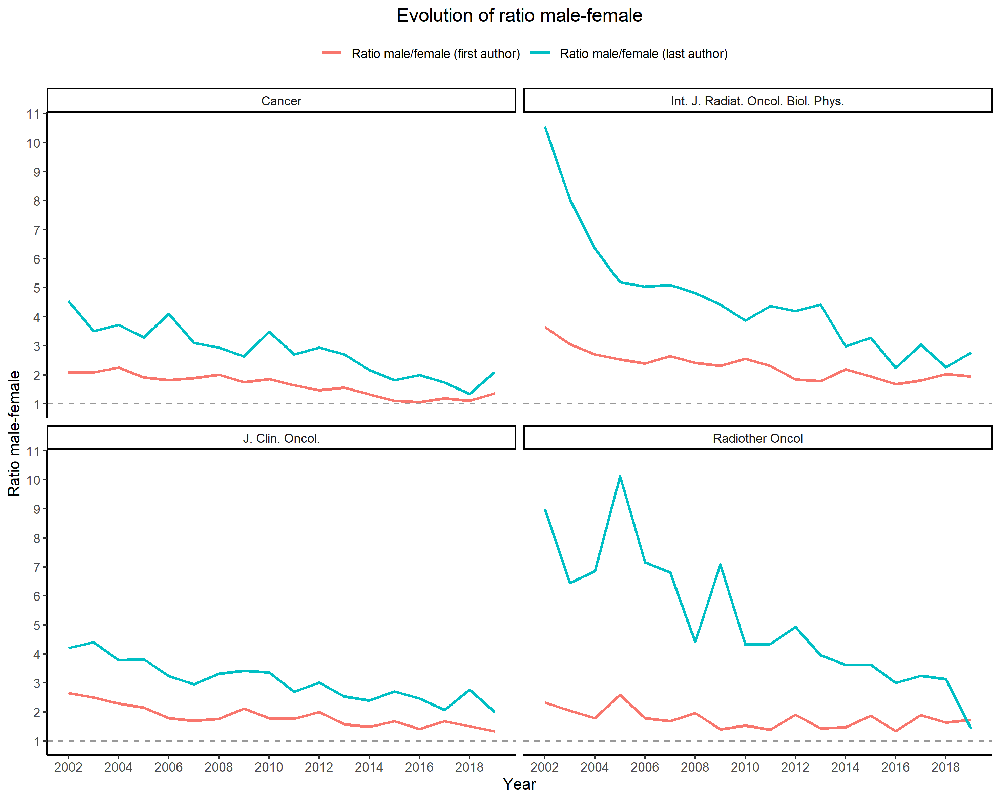

# Trends in Gender of Authors of Original Researches in Oncology Among Major Medical Journals: a Retrospective Bibliometric Study

**Authors**  
*Shing Fung Lee, Daniel Redondo-Sanchez, María José Sánchez-Pérez, Bizu Gelaye, Chi Leung Chiang, Irene Oi-Ling Wong, Denise Shuk-Ting Cheung, Miguel Angel Luque-Fernandez*

# Abstract

**Objective**

We evaluated the temporal trend of the gender ratio of first and last authors in the oncological research field among major general medical and oncology journals and examine the gender pattern in coauthorship. 

**Design**

We conducted a retrospective study in PubMed using the R package RISmed. We retrieved original research articles from four general medical and six oncology specialty journals selected based on their impact factors and popularity among oncologists. We identified the names of first and last authors from Jan 1, 2002 to Dec 31, 2019. The authors’ genders were identified and validated using the Gender-API database (https://gender-api.com/). 
Primary and secondary outcome measures: the percentages of first and last authors by gender and the gender ratios (male/female) and the temporal trends in gender ratios of first and last authors were determined.

**Results**

We identified 34,624 research articles, in which 32,452 had the gender of both first and last authors identified. We identified 11,650 (33.6%) and 7,908 (22.8%) with women as first and last author, respectively. The proportions of female first and last authors increased from 26.6% and 16.2% in 2002, respectively, to 32.9% and 27.5% in 2019, respectively. The first and last author gender ratio (male/female) decreased by 1.5% and 2.6% per year, respectively (first author: incidence rate ratio [IRR], 0.98; 95% confidence interval [CI], 0.97-1.00 and last author: IRR, 0.97; 95% CI, 0.96-0.99). Male first and last authorship was the most common combination. male-female and female-female pairs increased by 2.0% and 5.0%, respectively (IRR, 1.02; 95% CI, 1.01 - 1.03 and IRR, 1.05; 95% CI, 1.04-1.06, respectively).

**Conclusions**

The continued underrepresentation of women means that that more efforts to address parity for the advancement of women in academic oncology and initiatives to promote academic choices and careers of women at the student level are needed.

**Keywords**: *academic success*; *authorship*; *neoplasms*; *research*; *publications*.

This repository provides open source code for replicability.
